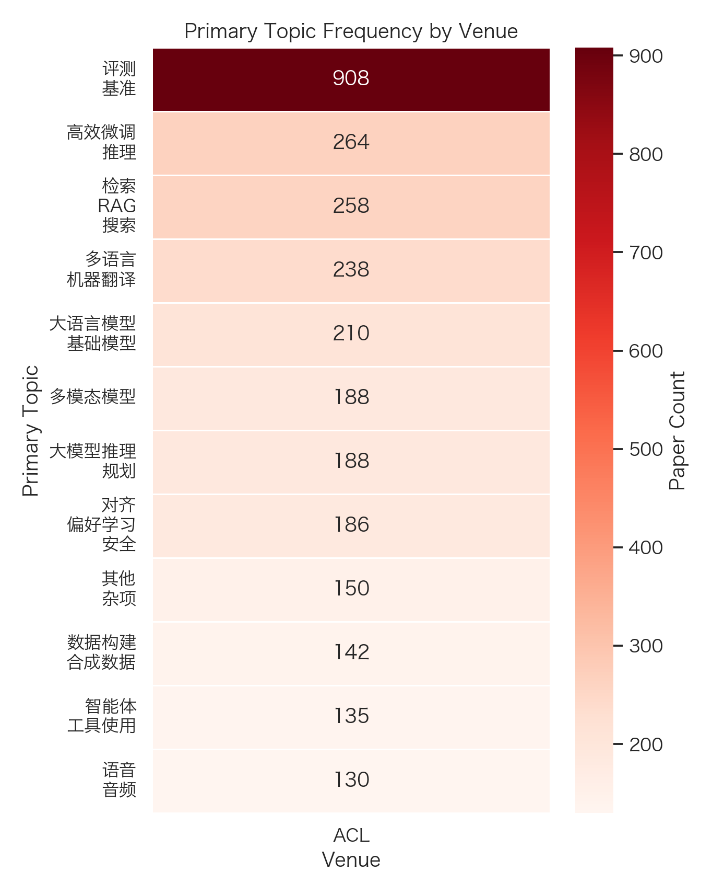
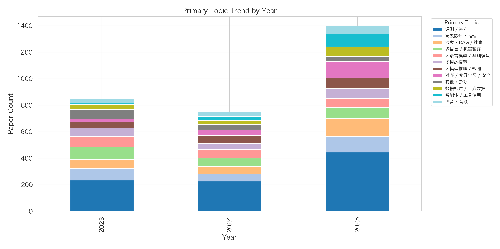
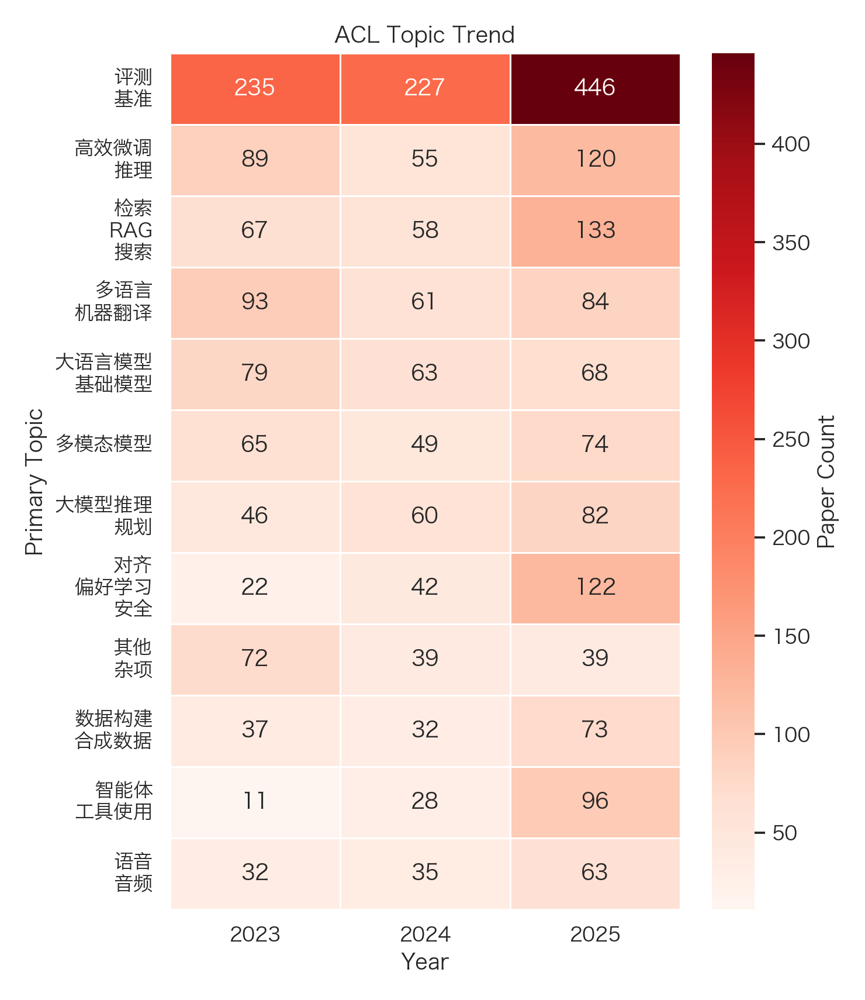

# ACL Literature Survey (2023-2025)

[Back to results index](../README.md)

- Total papers: 4059
- Venues: ACL
- Years: 2025, 2024, 2023

## Paper Counts by Venue and Year

| venue | year | paper_count |
| --- | --- | --- |
| ACL | 2025 | 1872 |
| ACL | 2024 | 978 |
| ACL | 2023 | 1209 |

## Top Primary Topics by Venue

### ACL

| topic | count |
| --- | --- |
| Evaluation / Benchmarks / 评测 / 基准 | 908 |
| Efficient Tuning / Inference / 高效微调 / 推理 | 264 |
| Retrieval / RAG / Search / 检索 / RAG / 搜索 | 258 |
| Multilingual / Translation / 多语言 / 机器翻译 | 238 |
| LLM / Foundation Models / 大语言模型 / 基础模型 | 210 |
| Multimodal Models / 多模态模型 | 188 |
| LLM Reasoning / Planning / 大模型推理 / 规划 | 188 |
| Alignment / Preference / Safety / 对齐 / 偏好学习 / 安全 | 186 |
| Other / Misc / 其他 / 杂项 | 150 |
| Data Curation / Synthetic Data / 数据构建 / 合成数据 | 142 |

## Top Primary Topics by Year

### 2023

| topic | count |
| --- | --- |
| Evaluation / Benchmarks / 评测 / 基准 | 235 |
| Multilingual / Translation / 多语言 / 机器翻译 | 93 |
| Efficient Tuning / Inference / 高效微调 / 推理 | 89 |
| LLM / Foundation Models / 大语言模型 / 基础模型 | 79 |
| Other / Misc / 其他 / 杂项 | 72 |
| Retrieval / RAG / Search / 检索 / RAG / 搜索 | 67 |
| Multimodal Models / 多模态模型 | 65 |
| Representation / Self-Supervised Learning / 表征学习 / 自监督学习 | 64 |
| OOD / Robustness / 分布外泛化 / 鲁棒性 | 52 |
| LLM Reasoning / Planning / 大模型推理 / 规划 | 46 |

### 2024

| topic | count |
| --- | --- |
| Evaluation / Benchmarks / 评测 / 基准 | 227 |
| LLM / Foundation Models / 大语言模型 / 基础模型 | 63 |
| Multilingual / Translation / 多语言 / 机器翻译 | 61 |
| LLM Reasoning / Planning / 大模型推理 / 规划 | 60 |
| Retrieval / RAG / Search / 检索 / RAG / 搜索 | 58 |
| Efficient Tuning / Inference / 高效微调 / 推理 | 55 |
| Multimodal Models / 多模态模型 | 49 |
| Alignment / Preference / Safety / 对齐 / 偏好学习 / 安全 | 42 |
| Other / Misc / 其他 / 杂项 | 39 |
| Speech / Audio / 语音 / 音频 | 35 |

### 2025

| topic | count |
| --- | --- |
| Evaluation / Benchmarks / 评测 / 基准 | 446 |
| Retrieval / RAG / Search / 检索 / RAG / 搜索 | 133 |
| Alignment / Preference / Safety / 对齐 / 偏好学习 / 安全 | 122 |
| Efficient Tuning / Inference / 高效微调 / 推理 | 120 |
| Agents / Tool Use / 智能体 / 工具使用 | 96 |
| Multilingual / Translation / 多语言 / 机器翻译 | 84 |
| LLM Reasoning / Planning / 大模型推理 / 规划 | 82 |
| Multimodal Models / 多模态模型 | 74 |
| Data Curation / Synthetic Data / 数据构建 / 合成数据 | 73 |
| Adversarial / Security / 对抗 / 安全 | 70 |

## Top Paper Types

| paper_type | count |
| --- | --- |
| method | 2229 |
| evaluation_analysis | 706 |
| benchmark_dataset | 671 |
| application | 211 |
| system | 167 |
| theory | 75 |

## Figures

### Venue Topic Heatmap

### Year Topic Stacked Bar

### Venue Topic Trend

