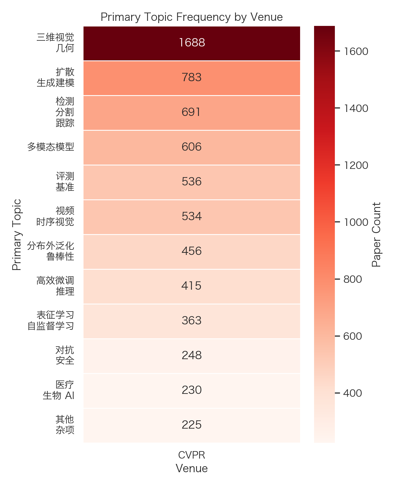
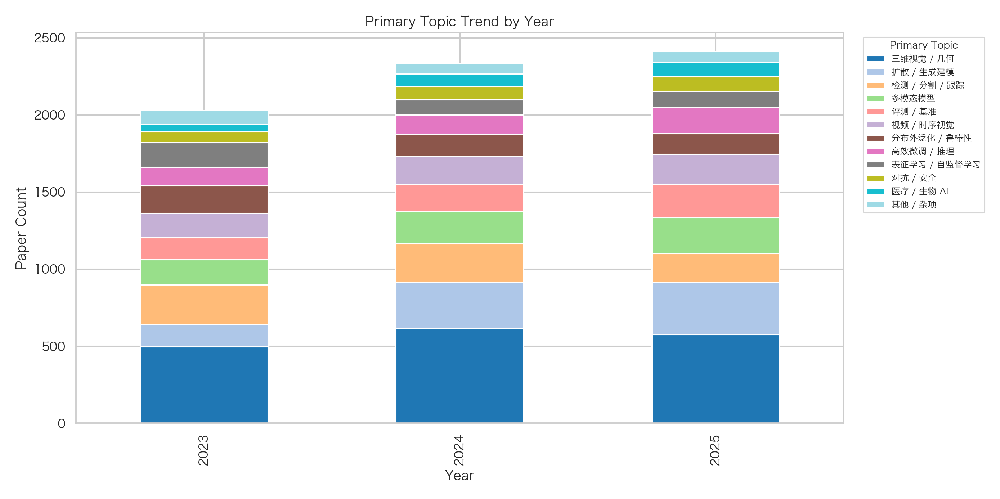
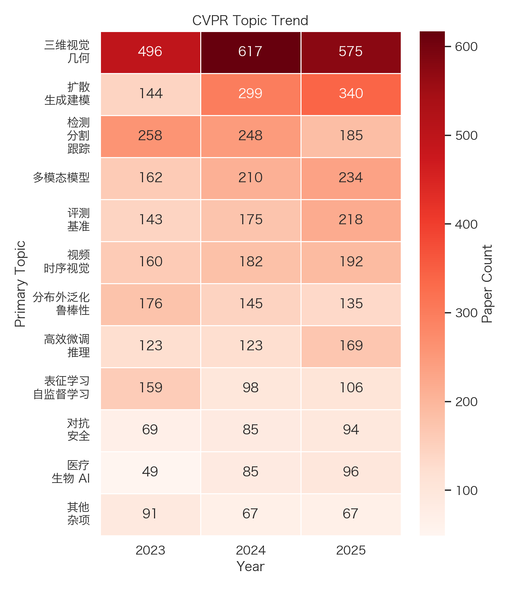

# CVPR Literature Survey (2023-2025)

[Back to results index](../README.md)

- Total papers: 7939
- Venues: CVPR
- Years: 2025, 2024, 2023

## Paper Counts by Venue and Year

| venue | year | paper_count |
| --- | --- | --- |
| CVPR | 2025 | 2871 |
| CVPR | 2024 | 2715 |
| CVPR | 2023 | 2353 |

## Top Primary Topics by Venue

### CVPR

| topic | count |
| --- | --- |
| 3D Vision / Geometry / 三维视觉 / 几何 | 1688 |
| Diffusion / Generative Modeling / 扩散 / 生成建模 | 783 |
| Detection / Segmentation / Tracking / 检测 / 分割 / 跟踪 | 691 |
| Multimodal Models / 多模态模型 | 606 |
| Evaluation / Benchmarks / 评测 / 基准 | 536 |
| Video / Temporal Vision / 视频 / 时序视觉 | 534 |
| OOD / Robustness / 分布外泛化 / 鲁棒性 | 456 |
| Efficient Tuning / Inference / 高效微调 / 推理 | 415 |
| Representation / Self-Supervised Learning / 表征学习 / 自监督学习 | 363 |
| Adversarial / Security / 对抗 / 安全 | 248 |

## Top Primary Topics by Year

### 2023

| topic | count |
| --- | --- |
| 3D Vision / Geometry / 三维视觉 / 几何 | 496 |
| Detection / Segmentation / Tracking / 检测 / 分割 / 跟踪 | 258 |
| OOD / Robustness / 分布外泛化 / 鲁棒性 | 176 |
| Multimodal Models / 多模态模型 | 162 |
| Video / Temporal Vision / 视频 / 时序视觉 | 160 |
| Representation / Self-Supervised Learning / 表征学习 / 自监督学习 | 159 |
| Diffusion / Generative Modeling / 扩散 / 生成建模 | 144 |
| Evaluation / Benchmarks / 评测 / 基准 | 143 |
| Efficient Tuning / Inference / 高效微调 / 推理 | 123 |
| Other / Misc / 其他 / 杂项 | 91 |

### 2024

| topic | count |
| --- | --- |
| 3D Vision / Geometry / 三维视觉 / 几何 | 617 |
| Diffusion / Generative Modeling / 扩散 / 生成建模 | 299 |
| Detection / Segmentation / Tracking / 检测 / 分割 / 跟踪 | 248 |
| Multimodal Models / 多模态模型 | 210 |
| Video / Temporal Vision / 视频 / 时序视觉 | 182 |
| Evaluation / Benchmarks / 评测 / 基准 | 175 |
| OOD / Robustness / 分布外泛化 / 鲁棒性 | 145 |
| Efficient Tuning / Inference / 高效微调 / 推理 | 123 |
| Representation / Self-Supervised Learning / 表征学习 / 自监督学习 | 98 |
| Adversarial / Security / 对抗 / 安全 | 85 |

### 2025

| topic | count |
| --- | --- |
| 3D Vision / Geometry / 三维视觉 / 几何 | 575 |
| Diffusion / Generative Modeling / 扩散 / 生成建模 | 340 |
| Multimodal Models / 多模态模型 | 234 |
| Evaluation / Benchmarks / 评测 / 基准 | 218 |
| Video / Temporal Vision / 视频 / 时序视觉 | 192 |
| Detection / Segmentation / Tracking / 检测 / 分割 / 跟踪 | 185 |
| Efficient Tuning / Inference / 高效微调 / 推理 | 169 |
| OOD / Robustness / 分布外泛化 / 鲁棒性 | 135 |
| Representation / Self-Supervised Learning / 表征学习 / 自监督学习 | 106 |
| Robotics / Embodied AI / 机器人 / 具身智能 | 97 |

## Top Paper Types

| paper_type | count |
| --- | --- |
| method | 6762 |
| benchmark_dataset | 531 |
| evaluation_analysis | 219 |
| application | 188 |
| system | 136 |
| theory | 103 |

## Figures

### Venue Topic Heatmap

### Year Topic Stacked Bar

### Venue Topic Trend

