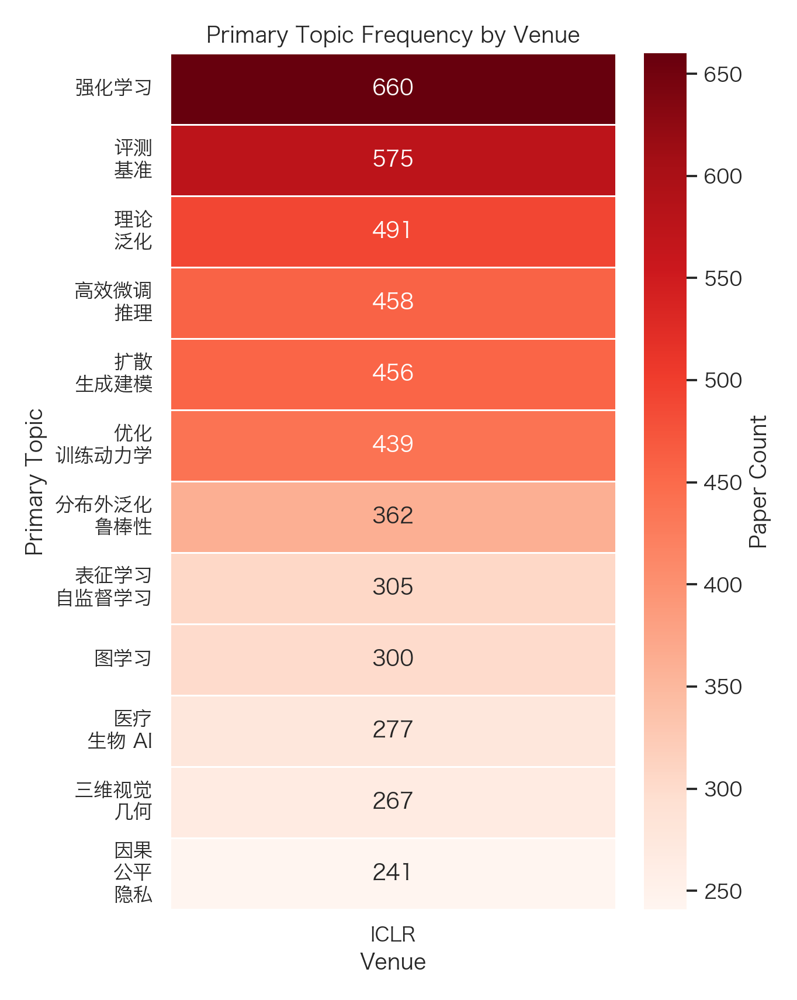
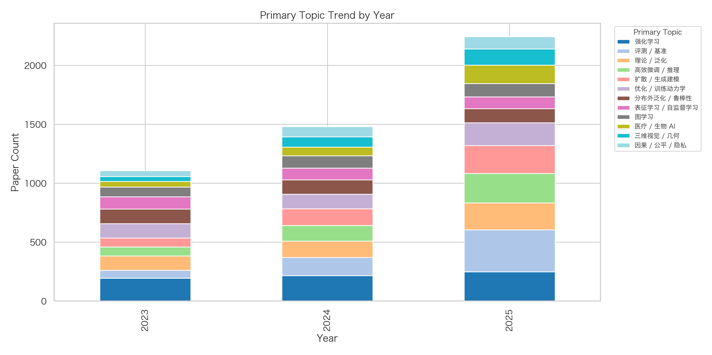
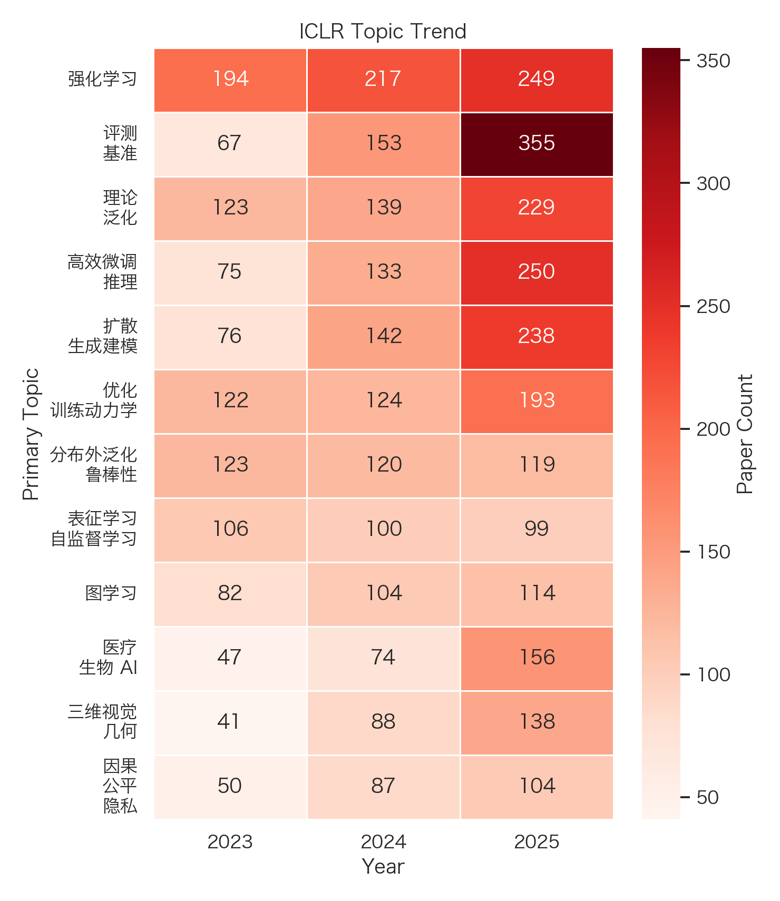

# ICLR Literature Survey (2023-2025)

[Back to results index](../README.md)

- Total papers: 7542
- Venues: ICLR
- Years: 2025, 2024, 2023

## Paper Counts by Venue and Year

| venue | year | paper_count |
| --- | --- | --- |
| ICLR | 2025 | 3708 |
| ICLR | 2024 | 2261 |
| ICLR | 2023 | 1573 |

## Top Primary Topics by Venue

### ICLR

| topic | count |
| --- | --- |
| Reinforcement Learning / 强化学习 | 660 |
| Evaluation / Benchmarks / 评测 / 基准 | 575 |
| Theory / Generalization / 理论 / 泛化 | 491 |
| Efficient Tuning / Inference / 高效微调 / 推理 | 458 |
| Diffusion / Generative Modeling / 扩散 / 生成建模 | 456 |
| Optimization / Training Dynamics / 优化 / 训练动力学 | 439 |
| OOD / Robustness / 分布外泛化 / 鲁棒性 | 362 |
| Representation / Self-Supervised Learning / 表征学习 / 自监督学习 | 305 |
| Graph Learning / 图学习 | 300 |
| Medical / Bio AI / 医疗 / 生物 AI | 277 |

## Top Primary Topics by Year

### 2023

| topic | count |
| --- | --- |
| Reinforcement Learning / 强化学习 | 194 |
| OOD / Robustness / 分布外泛化 / 鲁棒性 | 123 |
| Theory / Generalization / 理论 / 泛化 | 123 |
| Optimization / Training Dynamics / 优化 / 训练动力学 | 122 |
| Representation / Self-Supervised Learning / 表征学习 / 自监督学习 | 106 |
| Graph Learning / 图学习 | 82 |
| Diffusion / Generative Modeling / 扩散 / 生成建模 | 76 |
| Efficient Tuning / Inference / 高效微调 / 推理 | 75 |
| Evaluation / Benchmarks / 评测 / 基准 | 67 |
| Causality / Fairness / Privacy / 因果 / 公平 / 隐私 | 50 |

### 2024

| topic | count |
| --- | --- |
| Reinforcement Learning / 强化学习 | 217 |
| Evaluation / Benchmarks / 评测 / 基准 | 153 |
| Diffusion / Generative Modeling / 扩散 / 生成建模 | 142 |
| Theory / Generalization / 理论 / 泛化 | 139 |
| Efficient Tuning / Inference / 高效微调 / 推理 | 133 |
| Optimization / Training Dynamics / 优化 / 训练动力学 | 124 |
| OOD / Robustness / 分布外泛化 / 鲁棒性 | 120 |
| Graph Learning / 图学习 | 104 |
| Representation / Self-Supervised Learning / 表征学习 / 自监督学习 | 100 |
| 3D Vision / Geometry / 三维视觉 / 几何 | 88 |

### 2025

| topic | count |
| --- | --- |
| Evaluation / Benchmarks / 评测 / 基准 | 355 |
| Efficient Tuning / Inference / 高效微调 / 推理 | 250 |
| Reinforcement Learning / 强化学习 | 249 |
| Diffusion / Generative Modeling / 扩散 / 生成建模 | 238 |
| Theory / Generalization / 理论 / 泛化 | 229 |
| Optimization / Training Dynamics / 优化 / 训练动力学 | 193 |
| Alignment / Preference / Safety / 对齐 / 偏好学习 / 安全 | 168 |
| Medical / Bio AI / 医疗 / 生物 AI | 156 |
| 3D Vision / Geometry / 三维视觉 / 几何 | 138 |
| Multimodal Models / 多模态模型 | 136 |

## Top Paper Types

| paper_type | count |
| --- | --- |
| method | 4947 |
| theory | 1212 |
| evaluation_analysis | 661 |
| benchmark_dataset | 409 |
| application | 170 |
| system | 143 |

## Figures

### Venue Topic Heatmap

### Year Topic Stacked Bar

### Venue Topic Trend

