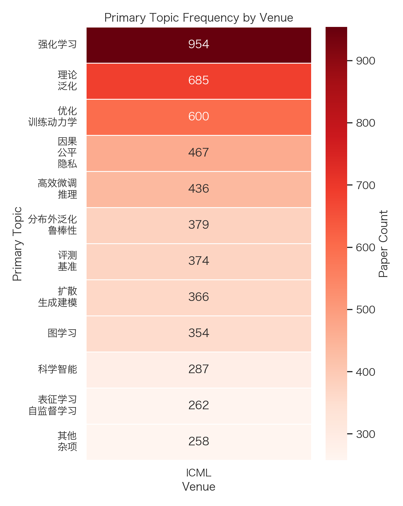
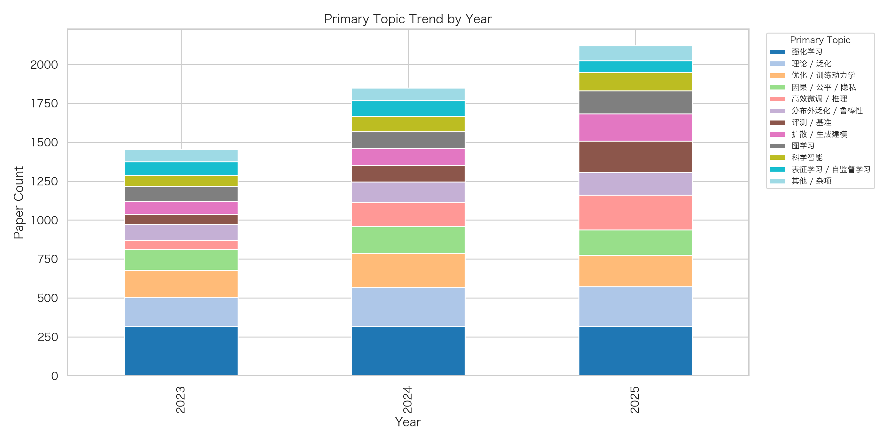
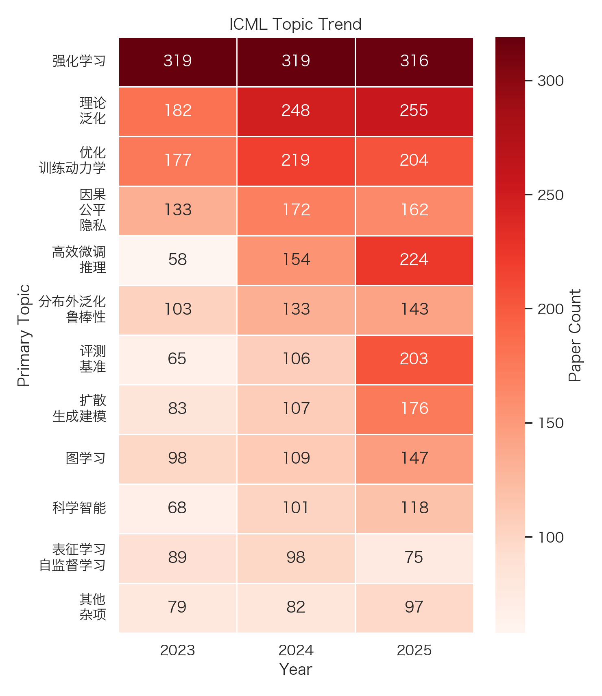

# ICML Literature Survey (2023-2025)

[Back to results index](../README.md)

- Total papers: 7768
- Venues: ICML
- Years: 2025, 2024, 2023

## Paper Counts by Venue and Year

| venue | year | paper_count |
| --- | --- | --- |
| ICML | 2025 | 3330 |
| ICML | 2024 | 2610 |
| ICML | 2023 | 1828 |

## Top Primary Topics by Venue

### ICML

| topic | count |
| --- | --- |
| Reinforcement Learning / 强化学习 | 954 |
| Theory / Generalization / 理论 / 泛化 | 685 |
| Optimization / Training Dynamics / 优化 / 训练动力学 | 600 |
| Causality / Fairness / Privacy / 因果 / 公平 / 隐私 | 467 |
| Efficient Tuning / Inference / 高效微调 / 推理 | 436 |
| OOD / Robustness / 分布外泛化 / 鲁棒性 | 379 |
| Evaluation / Benchmarks / 评测 / 基准 | 374 |
| Diffusion / Generative Modeling / 扩散 / 生成建模 | 366 |
| Graph Learning / 图学习 | 354 |
| Scientific AI / 科学智能 | 287 |

## Top Primary Topics by Year

### 2023

| topic | count |
| --- | --- |
| Reinforcement Learning / 强化学习 | 319 |
| Theory / Generalization / 理论 / 泛化 | 182 |
| Optimization / Training Dynamics / 优化 / 训练动力学 | 177 |
| Causality / Fairness / Privacy / 因果 / 公平 / 隐私 | 133 |
| OOD / Robustness / 分布外泛化 / 鲁棒性 | 103 |
| Graph Learning / 图学习 | 98 |
| Representation / Self-Supervised Learning / 表征学习 / 自监督学习 | 89 |
| Diffusion / Generative Modeling / 扩散 / 生成建模 | 83 |
| Other / Misc / 其他 / 杂项 | 79 |
| Federated / Distributed Learning / 联邦 / 分布式学习 | 69 |

### 2024

| topic | count |
| --- | --- |
| Reinforcement Learning / 强化学习 | 319 |
| Theory / Generalization / 理论 / 泛化 | 248 |
| Optimization / Training Dynamics / 优化 / 训练动力学 | 219 |
| Causality / Fairness / Privacy / 因果 / 公平 / 隐私 | 172 |
| Efficient Tuning / Inference / 高效微调 / 推理 | 154 |
| OOD / Robustness / 分布外泛化 / 鲁棒性 | 133 |
| Graph Learning / 图学习 | 109 |
| Diffusion / Generative Modeling / 扩散 / 生成建模 | 107 |
| Evaluation / Benchmarks / 评测 / 基准 | 106 |
| Scientific AI / 科学智能 | 101 |

### 2025

| topic | count |
| --- | --- |
| Reinforcement Learning / 强化学习 | 316 |
| Theory / Generalization / 理论 / 泛化 | 255 |
| Efficient Tuning / Inference / 高效微调 / 推理 | 224 |
| Optimization / Training Dynamics / 优化 / 训练动力学 | 204 |
| Evaluation / Benchmarks / 评测 / 基准 | 203 |
| Diffusion / Generative Modeling / 扩散 / 生成建模 | 176 |
| Causality / Fairness / Privacy / 因果 / 公平 / 隐私 | 162 |
| Graph Learning / 图学习 | 147 |
| OOD / Robustness / 分布外泛化 / 鲁棒性 | 143 |
| Medical / Bio AI / 医疗 / 生物 AI | 136 |

## Top Paper Types

| paper_type | count |
| --- | --- |
| method | 4479 |
| theory | 2058 |
| evaluation_analysis | 643 |
| application | 200 |
| system | 194 |
| benchmark_dataset | 194 |

## Figures

### Venue Topic Heatmap

### Year Topic Stacked Bar

### Venue Topic Trend

